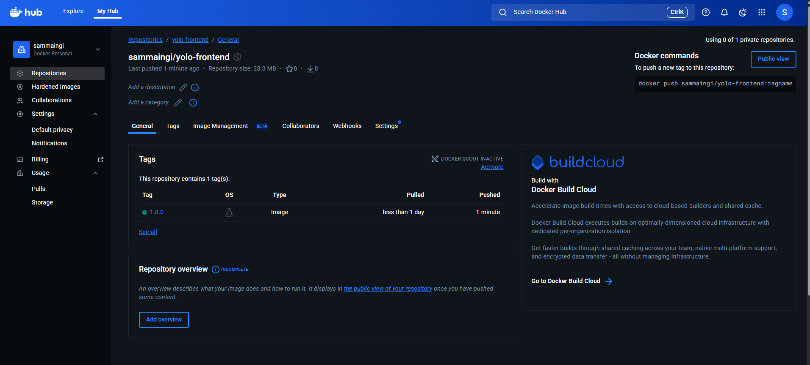
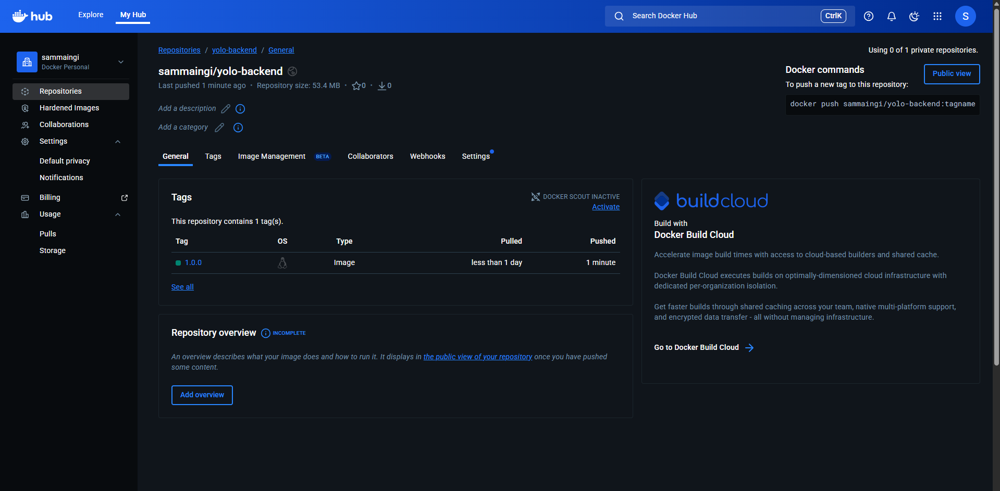
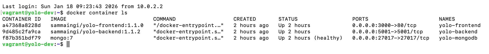
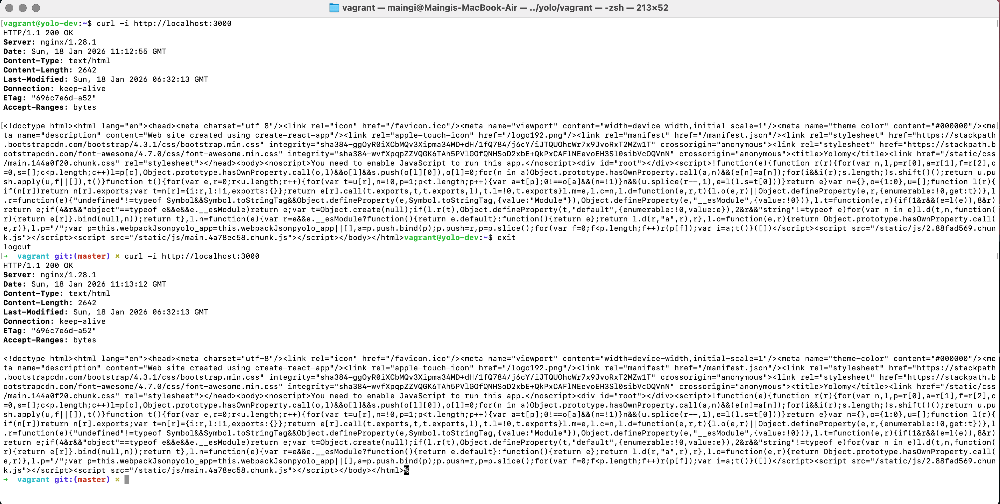
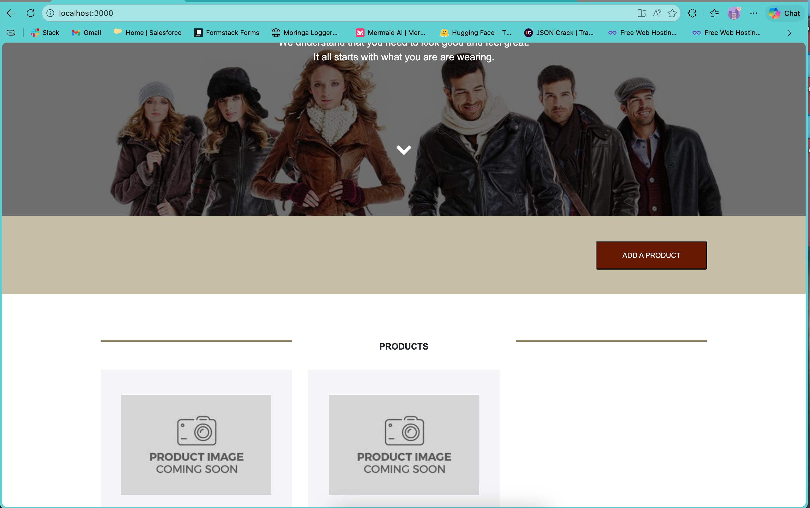
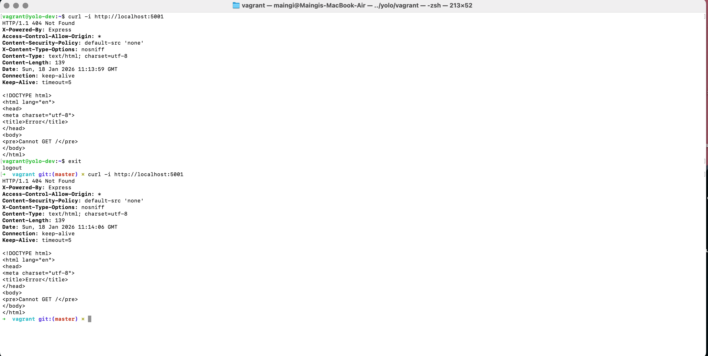
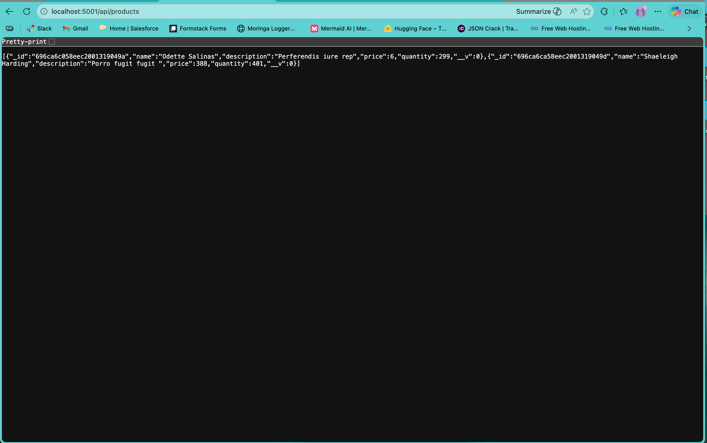

# Docker + Ansible + Vagrant Implementation Documentation
## YOLO E-Commerce Application

This Explanation demostates I used Vagrant to provision a development virtual machine and Ansible to automate the deployment of my Dockerized YOLO e-commerce application with 3-teir stack (Frontend, Backend, and MongoDB).

### Table of Content
1. [Docker Explanation](#docker-explanation)
2. [Vagrant Explanation](#vagrant-explanation)
3. [Ansible Explanation](#ansible-explanation)
4. [Commplete WorkFlow - Setup and Demo](#commplete-workflow---setup-and-demo)
---
### Project Strucuture

```
yolo/
|-- vagrant/
│   -- Vagrantfile  # VM configuration and provisioning
│   -- .vagrant/  # Vagrant metadata (auto-generated)
|
|-- ansible/
│   |-- ansible.cfg  # Ansible configuration
│   |-- group_vars/
│   |   -- all.yml   # Global variables for all environments
│   |-- inventory/
│   │   -- development/
│   │       -- hosts.ini    # Development environment hosts
│   |-- playbooks/
│   |     -- deploy-dev.yml   # Main deployment playbook
│   |-- roles/    # Ansible roles for each component
│        -- backend/
│        -- common/
│        -- docker/
│        -- frontend/
│        -- mongodb/
|
|-- backend/
|-- client/
|-- .gitignore
|-- backend.png
|-- frontend.png
|-- docker-compose.yml
|-- LICENSE
|-- README.md
```

---
# Docker Explanation

## 1. Base Image Selection

*MongoDB:*
Went with `mongo:7`- it's the official MongoDB image, works out of the box, and gets regular updates. Didn't see any reason to customize it or use something else.

*Backend:*
Used `node:18-alpine` because Alpine is tiny - cuts the image from ~900MB to 5MB. Less to download, faster deployments, and smaller attack surface. Still has everything Node needs to run.

*Frontend:*
Used a multi-stage build here with two different images:

Build stage - `node:18-alpine`
Need Node to compile the React app. Kept it consistent with the backend by using Alpine here too. This stage has access to npm and all the build tools needed.

Production stage - `nginx:stable-alpine`
React compiles down to just HTML, CSS, and JavaScript files. Don't need Node anymore at this point, just a web server. Nginx with Alpine gets the final image down to about 23MB and handles serving static files really well with built-in caching and compression.

The multi-stage approach basically lets me use the heavy build tools, then throw them away and keep only what's needed to actually run the app. Got the production image size down by 97% this way.

## 2. Dockerfile Architecture

### Backend Dockerfile

```dockerfile
FROM node:18-alpine
WORKDIR /app
```
Sets up the base image and working directory for subsequent operations.

```dockerfile
COPY package.json .
COPY package-lock.json .
RUN npm ci --omit=dev
```
Dependancies are copied prior to applications source code to leverage dockers layer caching mechanism and this ensures that unchanged dependancies don't trigger reinstallation during subsequent builds.

Used `npm ci` instead of `npm install` because it's more reliable installs exactly what's in package-lock.json. The `--omit=dev` flag skips dev dependencies to keep the image smaller.

```dockerfile
COPY . .
EXPOSE 5001
ENV PORT=5001
CMD ["npm", "start"]
```
Application source code is copied after dependency installation to maximize cache efficiency.

`EXPOSE` directive documents port usage, while `ENV` establishes runtime configuration. 

`CMD` directive employs exec form for proper signal handling.

### Frontend Dockerfile

**Build Stage:**
```dockerfile
FROM node:18-alpine AS build
WORKDIR /app
COPY package.json .
COPY package-lock.json .
RUN npm ci
COPY . .
RUN NODE_OPTIONS=--openssl-legacy-provider npm run build
```
Build stage compiles the React application with all necessary development dependencies. 

`NODE_OPTIONS` flag addresses OpenSSL compatibility requirements with legacy React build tools.

**Production Stage:**
```dockerfile
FROM nginx:stable-alpine AS production
COPY --from=build /app/build /usr/share/nginx/html
EXPOSE 80
CMD ["nginx", "-g", "daemon off;"]
```
The production stage extracts only compiled artifacts from the build stage, eliminating build tools and dependencies. The `--from=build` flag enables selective copying between stages. Nginx operates in foreground mode (`daemon off`) to maintain container lifecycle.

---

## 3. Network Architecture and Port Configuration

### Port Allocation

*MongoDB Service:*
The standard MongoDB port
```yaml
ports:
  - "27017:27017"
```

*Backend Service:*
API endpoint
```yaml
ports:
  - "5001:5001"
```

*Frontend Service:*
Nginx serves on port 80 inside the container, mapped to port 3000 on my machine (keeps it consistent with the usual React dev setup)
```yaml
ports:
  - "3000:80"
```

### Network Implementation

```yaml
networks:
  yolo-network:
    driver: bridge
```

Set up a bridge network so all the containers can talk to each other. The cool thing about Docker networks is they have built-in DNS. So the backend can just connect to `mongodb://mongodb:27017/yolo` using the service name, and Docker figures out the IP address automatically. Way easier than managing IPs manually.

Other benefits:
- Containers are isolated from external networks and other Docker networks
- Service names automatically resolve to the right container
- Traffic between containers stays inside the Docker network

*How it all connects:*
```
Browser → Frontend (hostmachine:80) → Backend (backend:5001) → MongoDB (mongodb:27017)
```

## 4. Volume Management and Data Persistence

### Volume Configuration

```yaml
volumes:
  mongodb_data:
  mongodb_config:

services:
  mongodb:
    volumes:
      - mongodb_data:/data/db
      - mongodb_config:/data/configdb
```

MongoDB needs volumes or all the data disappears when you stop the container. Set up two volumes:

*mongodb_data → /data/db*
Where MongoDB stores all the actual database stuff - collections, documents, indexes, everything. Without this, you lose all your data when the container restarts.

*mongodb_config → /data/configdb* 
Stores MongoDB's config files and settings so everything stays consistent across restarts.

*How it works:*
```
Container Start → Volume Mount → Data Operations → Container Stop → Data Persists
```

## 5. Getting It Running

*Build Process:*
```bash
docker-compose build
```
All services compiled successfully without dependency resolution failures or build errors.

*Container Initialization:*
```bash
docker-compose up -d
```
Services started in detached mode `-d` with no immediate failures or restart loops.

*Verification:*
```bash
docker-compose ps
```
Expected output:
```
NAME            IMAGE           COMMAND                  SERVICE    CREATED         STATUS         PORTS
yolo-backend    yolo-backend    "docker-entrypoint.s…"   backend    50 minutes ago   Up 50 minutes   0.0.0.0:5001->5001/tcp, [::]:5001->5001/tcp
yolo-frontend   yolo-frontend   "/docker-entrypoint.…"   frontend   50 minutes ago   Up 50 minutes   0.0.0.0:3000->80/tcp, [::]:3000->80/tcp
yolo-mongodb    mongo:7         "docker-entrypoint.s…"   mongodb    50 minutes ago   Up 50 minutes  0.0.0.0:27017->27017/tcp, [::]:27017->27017/tcp
```

**Functional Testing:**
- Frontend accessible at http://localhost:80
- Backend API responsive at http://localhost:5001  
- Database connectivity verified
- CRUD operations functional


## 6. Naming Convention

Kept it simple with the format yolo-[service]:

- `yolo-mongodb` - database
- `yolo-backend` - API
- `yolo-frontend` - web interface

Makes it obvious what's what when looking at container lists and logs.


## 7. Publishing to Docker Hub

*Login:*
```bash
docker login
```

*Tag the images:*
```bash
docker tag yolo-backend sammaingi/yolo-backend:1.0.0
docker tag yolo-frontend sammaingi/yolo-frontend:1.0.0
```

*Push to Docker Hub:*
```bash
docker push sammaingi/yolo-backend:1.0.0
docker push sammaingi/yolo-frontend:1.0.0
```

*Pull them later:*
```bash
docker pull sammaingi/yolo-backend:1.0.0
docker pull sammaingi/yolo-frontend:1.0.0
```

Images are now available at:

Backend: https://hub.docker.com/r/sammaingi/yolo-backend

Frontend: https://hub.docker.com/r/sammaingi/yolo-frontend

### Screenshot:

*Frontend Repository:*

*Figure 1: DockerHub repository showing yolo-frontend image with version 1.0.0*

*Backend Repository:*

*Figure 2: DockerHub repository showing yolo-backend image with version 1.0.0*

---

# Vagrant Explanation

### Configuration Details
In the Vagrantfile it contains
- Base box: Ubuntu 22.04 (Jammy Jelly) - Lastest offered by Cancanical
- Hostname: `yolo-dev`
- Private Network: `192.168.56.10`
- Port Forwarding:
    - Frontend: 3000 -> 3000
    - Backend: 5001 -> 5001
    - MongoDB: 27017 -> 27017
- Resources: `1024 MB RAM, 2CPUs`
- Provisioning: Ansible playbook execution

Essentials Basic Commands
```bash
cd vagrant

# initialize and start VM
vagrant up

# ssh to VM
vagrant ssh

# Provisioning without recreating VM
vagrant provision

# Stop VM
vagrant halt

# Destory VM
vagrant destroy
```
---

# Ansible Explanation

### Configuration Files and Setup

`ansible.cfg` :
It Sets the following:
- Roles path: where the roles are located
- inventory: where the ip address and hosts will be
- Disable SSH Key only for development convenience

`deply-dev.yml` :
It's a playbook that orchestrates the deployment in this order:
- Common Role: System pre-requisties and base packages
- Docker Role: Docker engine Installation and Configuration
- MongoDB ROle: For MongoDB container deployment
- Backend Role: For Backend container deployment
- Frontend Rolee: For React Frontend Container

`group_vars/all.yml` :
It's a Centralized file holding configuration variables. Incase of any modifications one could navigate to `vagrant\` and run `vagrant provision` to apply changes

The Access Points: Frontend 
- Frontend: http://localhost:3000
- Backend API: http://localhost:5001
- MongoDB: mongodb://localhost:27017

Essentials Basic Commands

```bash

cd ansible

# To Run deployment playbook
ansible-playbook playbooks/deploy-dev.yml

# To Run Specific Roles using tags
ansible-playbook playbooks/deploy-dev.yml --tags "docker"
ansible-playbook playbooks/deploy-dev.yml --tags "backend,frontend"
ansible-playbook playbooks/deploy-dev.yml --tags "mongodb"

# To Check Playbook syntanx incase of any change
ansible-playbook playbooks/deploy-dev.yml --syntax-check

# Test Connection to all Hosts
ansible all -m ping

# To view Hosts
ansible-inventory --list
```

---
# Commplete WorkFlow - Setup and Demo

#### Initial Setup
```bash
cd vagrant

# Start VM and auto-provision with Ansible
vagrant up

# It will perform the following:
# 1. Download Ubuntu 22.04 base box (first time only)
# 2. Create and configure the VM
# 3. Set up networking and port forwarding
# 4. Execute Ansible playbook automatically
# 5. Deploy entire application stack

```

#### For Deveploment

```bash
# any change to playbooks
nano ../ansible/roles/backend/tasks/main.yml

# Re-provision without recreating VM
vagrant provision

# OR

# re-run Ansible manually with more control
vagrant ssh
cd /vagrant/ansible
ansible-playbook playbooks/deploy-dev.yml --tags "backend"
exit
```

#### Cleanup
```bash
# Stop VM and Preserves state
vagrant halt

# Completely remove of VM
vagrant destroy

# Remove downloaded box
vagrant box remove ubuntu/jammy64
```

### Demo Pictures and Running Containers

*Docker Containers Running in VM:*

*Figure 3: Docker Containers Running in VM*

#### Frontend

*Frontend Running in VM, Localhost*

*Figure 4: Frontend Running in VM, Localhost*

*Frontend Running in Browser*

*Figure 5: Frontend Running in Browser*

#### Backend

*Backend Running in VM, Localhost*

*Figure 6: Backend Running in VM, Localhost*

*Backend Running in Browser*

*Figure 7: Backend Running in Browser*